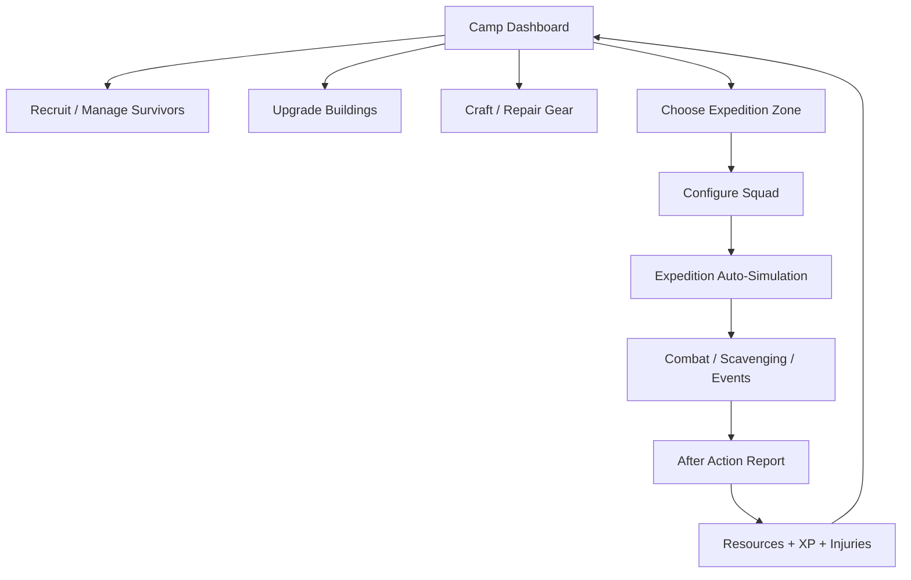
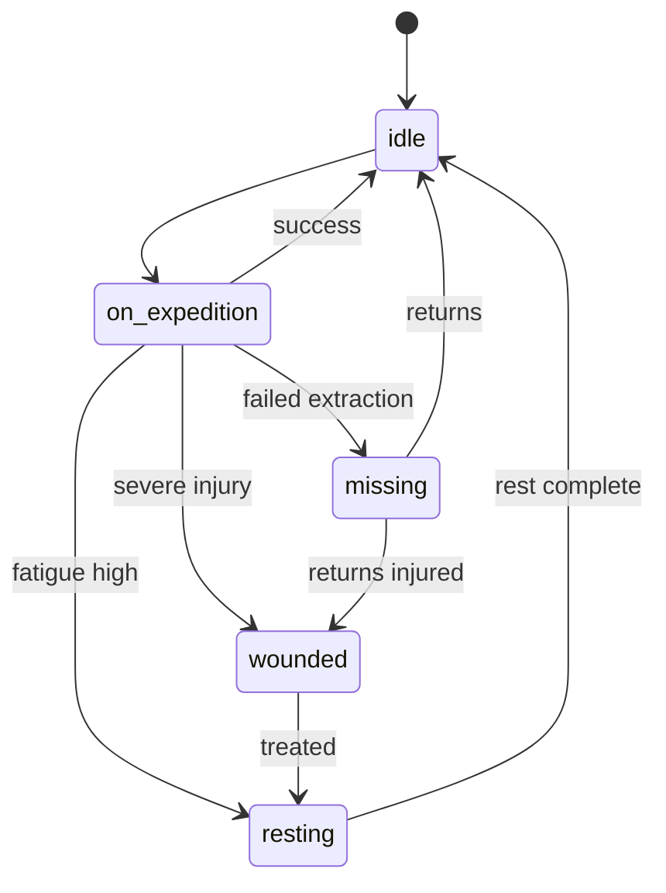

# Ashfall Camp — Game Design Document

> **Документ:** геймдизайн, UX, контент и баланс  
> **Проект:** Ashfall Camp  
> **Жанр:** Idle RPG / skill-based incremental / survival camp management  
> **Платформа:** PC / Steam  
> **Парный документ:** `ashfall_camp_architecture_unity_mcp.md` содержит Unity/MCP архитектуру, стек, DI, MVP, async policy, конфиги и требования к реализации.

---

## 0. Короткий питч

Игрок — новый лидер лагеря выживших после апокалипсиса. Он принимает выживших, снаряжает их, отправляет отряды в пустошь за припасами, наблюдает за автоматическими боями с мутантами и рейдерами, а затем тратит добытые ресурсы на развитие лагеря, снаряжение и новые маршруты.

**Главная фантазия:** не один герой становится сильнее, а весь лагерь превращается из ржавого укрытия в организованное поселение.

**Одно предложение для Steam:**

> Lead a camp of survivors in an idle post-apocalyptic RPG. Send squads into the wasteland, watch them auto-fight mutants and raiders, bring back scrap and supplies, and rebuild your camp one upgrade at a time.

---

## 1. Дизайн-столпы

### 1.1. Лагерь — это главный персонаж

Игрок прокачивает не только отдельных выживших, а весь лагерь: вместимость, медицину, мастерскую, разведку, воду, снаряжение, доктрины и доступные зоны.

### 1.2. Решения принимаются до экспедиции

Игра не должна превращаться в ручной тактический бой. Основные решения:

- кого отправить;
- куда отправить;
- какое оружие и броню дать;
- какую политику поведения выбрать;
- сколько припасов взять;
- рискнуть или отступить.

### 1.3. Наблюдение за боем опционально

Игрок может открыть экран экспедиции и смотреть лог боя, но игра должна нормально играться в idle/offline-режиме.

Активное наблюдение даёт контроль и небольшую оптимизацию, но не должно быть обязательным.

### 1.4. Риск должен быть добровольным

Случайная потеря прокачанного выжившего во время offline-прогресса — плохой опыт. В обычных зонах выжившие получают ранения, усталость или пропадают на время. Реальная смерть возможна только в явно помеченных высокорисковых экспедициях.

### 1.5. Каждый новый ресурс должен открывать новую проблему

Не добавлять ресурсы ради количества. Новый ресурс должен менять решения игрока:

- `food` ограничивает длительность и количество экспедиций;
- `water` открывает дальние зоны;
- `weapon_parts` позволяют ремонтировать и улучшать оружие;
- `medicine` снижает downtime после ранений;
- `electronics` открывает автоматизацию и разведку.

### 1.6. Steam-first, не mobile-порт

Игра должна ощущаться как premium PC idle RPG:

- без рекламы;
- без energy systems;
- без forced daily rewards;
- без продажи ускорителей;
- с offline progress, Steam Cloud, achievements и хорошим UI.

---

## 2. Целевая версия

### 2.1. MVP / Demo на 1 месяц

Цель MVP — доказать core loop, сделать Steam-демо на 30–90 минут активной игры и 6–10 часов idle-прогрессии.

#### В MVP обязательно

- 5 основных ресурсов:
  - `scrap`;
  - `food`;
  - `water`;
  - `weapon_parts`;
  - `medicine`.
- 6 навыков выживших:
  - `scavenging`;
  - `melee`;
  - `firearms`;
  - `survival`;
  - `mechanics`;
  - `medicine`.
- 5 зданий лагеря:
  - `barracks`;
  - `workshop`;
  - `water_collector`;
  - `infirmary`;
  - `radio_tower`.
- 5 зон экспедиций:
  - `abandoned_store`;
  - `dry_suburb`;
  - `ruined_clinic`;
  - `police_outpost`;
  - `mutant_tunnel`.
- 6 типов врагов.
- 10–15 предметов экипировки.
- 20–30 апгрейдов лагеря/зданий.
- 6–8 рекрутируемых выживших.
- Автобой с логом.
- Offline progress до 8–12 часов.
- Autosave.
- After Action Report после экспедиций.
- Один финальный демо-челлендж: зачистить `mutant_tunnel` или построить `radio_tower` level 2.

#### В MVP не делать

- полноценные фракции;
- торговлю между поселениями;
- рейды на лагерь;
- базу с grid-layout как в Fallout Shelter;
- ручные тактические бои;
- патроны на каждый выстрел;
- сложную мораль;
- болезни как отдельную систему;
- детей/семьи;
- procedural world map;
- 20+ навыков;
- 50+ ресурсов;
- случайную permadeath в offline.

---

### 2.2. Early Access scope

После MVP расширять игру до Early Access:

- 15–25 зон;
- 20–30 врагов;
- 40–60 предметов;
- 8–10 зданий;
- 8–10 ресурсов;
- 20+ backgrounds/traits;
- 100+ upgrades;
- 20–40 часов прогрессии;
- prestige / relocation layer;
- Steam achievements;
- Steam Cloud;
- import/export save;
- weekly balance patches.

---

## 3. Игровые циклы

### 3.1. Моментальный цикл, 10–60 секунд

1. Игрок видит доступных выживших.
2. Выбирает зону.
3. Проверяет риск и награды.
4. Отправляет отряд.
5. Смотрит или не смотрит автобой.
6. Получает лог, лут, XP, ранения.

### 3.2. Средний цикл, 5–15 минут

1. Несколько экспедиций приносят ресурсы.
2. Игрок строит или улучшает здание.
3. Открывается новая зона, предмет или слот выжившего.
4. Игрок оптимизирует состав отрядов.
5. Следующая зона требует нового ресурса/навыка.

### 3.3. Длинный цикл, 1–3 часа

1. Игрок открывает опасную зону.
2. Готовит отряд: оружие, броня, медицина.
3. Проходит мини-босса или рискованную экспедицию.
4. Получает blueprint / permanent upgrade.
5. Лагерь выходит на новый этап развития.

### 3.4. Prestige loop, полная версия

1. Игрок развивает лагерь до предела текущей области.
2. Выполняет цель эвакуации/переезда.
3. Запускает `Relocate Camp`.
4. Часть прогресса сбрасывается.
5. Игрок получает `old_world_tech` / `blueprints`.
6. Новый лагерь начинает быстрее и глубже.

---

## 4. Основная структура игры



---


## 6. Game State

Ниже TypeScript-like структура. Её можно адаптировать под Unity C#, Godot GDScript/C#, JavaScript или другой стек.

```ts
type ResourceId =
  | "scrap"
  | "food"
  | "water"
  | "weapon_parts"
  | "medicine"
  | "electronics"
  | "armor_parts"
  | "fuel"
  | "intel"
  | "blueprints"
  | "old_world_tech";

type SurvivorState =
  | "idle"
  | "on_expedition"
  | "resting"
  | "wounded"
  | "missing";

type ExpeditionPolicy =
  | "cautious"
  | "balanced"
  | "aggressive"
  | "loot_focused"
  | "ammo_saving";

interface GameState {
  version: string;
  createdAt: number;
  lastSaveAt: number;
  totalPlayTimeSeconds: number;

  resources: Record<ResourceId, number>;
  resourceCaps: Partial<Record<ResourceId, number>>;

  survivors: Survivor[];
  inventory: InventoryItem[];
  buildings: Record<string, BuildingState>;
  zones: Record<string, ZoneState>;
  upgrades: Record<string, UpgradeState>;
  expeditions: ExpeditionState[];

  settings: GameSettings;
  statistics: GameStatistics;
}

interface Survivor {
  id: string;
  name: string;
  level: number;
  xp: number;
  backgroundId: string;
  traitIds: string[];

  state: SurvivorState;
  health: number;
  maxHealth: number;
  fatigue: number;
  morale: number;

  skills: Record<string, number>;
  skillXp: Record<string, number>;

  equipment: {
    weaponItemId?: string;
    armorItemId?: string;
    utilityItemId?: string;
  };

  statusEffects: StatusEffect[];
  currentExpeditionId?: string;
}

interface InventoryItem {
  uid: string;
  itemId: string;
  level: number;
  durability: number;
  maxDurability: number;
  equippedBySurvivorId?: string;
}

interface BuildingState {
  id: string;
  level: number;
  isUnlocked: boolean;
  upgradeStartedAt?: number;
  upgradeFinishedAt?: number;
}

interface ZoneState {
  id: string;
  isUnlocked: boolean;
  completions: number;
  familiarity: number;
  bestClearTimeSeconds?: number;
}

interface ExpeditionState {
  id: string;
  zoneId: string;
  survivorIds: string[];
  policy: ExpeditionPolicy;
  startedAt: number;
  expectedDurationSeconds: number;
  elapsedSeconds: number;
  progress: number;
  status: "active" | "returning" | "completed" | "failed";
  seed: number;
  log: ExpeditionLogEntry[];
  accumulatedLoot: Partial<Record<ResourceId, number>>;
  foundItems: InventoryItem[];
  enemiesDefeated: Record<string, number>;
}
```

---

## 7. Ресурсы

### 7.1. MVP-ресурсы

| ID | Название | Роль | Источник | Тратится на |
|---|---|---|---|---|
| `scrap` | Scrap | Основная валюта | почти все зоны | здания, рекрутинг, ремонт, базовые апгрейды |
| `food` | Food | Пайки для экспедиций | магазины, дома, события | запуск экспедиций, длинные маршруты |
| `water` | Water | Лимит дальних экспедиций | water collector, suburbs | экспедиции, recruitment, медицина |
| `weapon_parts` | Weapon Parts | Оружие и ремонт | police outpost, raiders | ремонт, крафт, апгрейд оружия |
| `medicine` | Medicine | Лечение ран | clinic, rare events | лечение, medkits, снижение downtime |

### 7.2. Поздние ресурсы

| ID | Название | Роль |
|---|---|---|
| `electronics` | Electronics | Радио, разведка, автоматизация, advanced upgrades |
| `armor_parts` | Armor Parts | Броня, защита, heavy gear |
| `fuel` | Fuel | Дальние зоны, convoy, prestige |
| `intel` | Intel | Особые миссии, фракции, боссы |
| `blueprints` | Blueprints | Постоянные unlocks |
| `old_world_tech` | Old World Tech | Prestige currency |

### 7.3. Правила ресурсов

- `scrap` в MVP не имеет cap.
- `food` и `water` имеют cap, который повышается зданиями.
- `medicine` имеет cap, который повышается `infirmary`.
- `weapon_parts` в MVP может не иметь cap, чтобы не мешать игроку.
- В MVP нет пассивного голода/жажды, который убивает лагерь.
- Food/Water — это стоимость экспедиции, а не таймер наказания.

### 7.4. Пример `ResourceCatalogSO` / serialized config snapshot

```config-data
[
  {
    "id": "scrap",
    "name": "Scrap",
    "description": "Main construction and repair material.",
    "hasCap": false,
    "startAmount": 15
  },
  {
    "id": "food",
    "name": "Food",
    "description": "Rations used to send survivors on expeditions.",
    "hasCap": true,
    "startAmount": 8,
    "startCap": 50
  },
  {
    "id": "water",
    "name": "Water",
    "description": "Clean water needed for longer expeditions and recovery.",
    "hasCap": true,
    "startAmount": 6,
    "startCap": 40
  },
  {
    "id": "weapon_parts",
    "name": "Weapon Parts",
    "description": "Used to repair and craft weapons.",
    "hasCap": false,
    "startAmount": 0
  },
  {
    "id": "medicine",
    "name": "Medicine",
    "description": "Used to heal wounded survivors.",
    "hasCap": true,
    "startAmount": 1,
    "startCap": 20
  }
]
```

---

## 8. Время, тики и offline progress

### 8.1. Основной tick

- Базовый симуляционный tick: `1 секунда`.
- Бой внутри экспедиции: `combat_tick = 2 секунды`.
- Expedition step: `10 секунд`.
- Autosave: каждые `30 секунд`, а также при старте/завершении экспедиции и при покупке апгрейда.

### 8.2. Offline progress

При загрузке игры:

```ts
offlineSeconds = clamp(now - gameState.lastSaveAt, 0, MAX_OFFLINE_SECONDS)
```

MVP значение:

```ts
MAX_OFFLINE_SECONDS = 12 * 60 * 60 // 12 часов
```

### 8.3. Симуляция offline progress

Unity MCP agent должен реализовать offline simulation без UI.

При входе игрок видит `Offline Report`:

- сколько времени прошло;
- какие экспедиции завершились;
- сколько ресурсов получено;
- кто получил XP;
- кто ранен;
- какие здания/лечение завершились.

### 8.4. Детерминированность

Каждая экспедиция получает `seed`. Все случайные события экспедиции должны использовать seeded RNG, чтобы:

- результат можно было воспроизвести;
- offline и active simulation не расходились;
- баги легче дебажить.

---

## 9. Выжившие

### 9.1. Роль выживших

Выжившие — основные “юниты” игры. Они:

- ходят в экспедиции;
- получают XP;
- прокачивают навыки;
- носят оружие/броню/утилити;
- получают ранения;
- создают эмоциональную привязанность.

### 9.2. Основные поля выжившего

| Поле | Описание |
|---|---|
| `name` | Имя выжившего |
| `level` | Общий уровень |
| `xp` | Общий опыт |
| `backgroundId` | Прошлое выжившего |
| `traitIds` | 1–2 черты |
| `skills` | Навыки 0–100 |
| `health` / `maxHealth` | Здоровье |
| `fatigue` | Усталость 0–100 |
| `morale` | Боевой дух 0–100 |
| `equipment` | Оружие, броня, утилити |
| `statusEffects` | Раны, кровотечение, усталость |
| `state` | idle/on_expedition/resting/wounded/missing |

### 9.3. Навыки MVP

| Skill ID | Название | Что влияет |
|---|---|---|
| `scavenging` | Scavenging | Больше лута, выше шанс редких находок |
| `melee` | Melee | Урон и выживаемость в ближнем бою |
| `firearms` | Firearms | Точность, крит, урон огнестрела |
| `survival` | Survival | Меньше расход еды/воды, меньше риск событий |
| `mechanics` | Mechanics | Locked containers, ремонт, electronics loot |
| `medicine` | Medicine | Лечение, шанс избежать тяжёлой травмы |

### 9.4. Общий уровень

Уровень даёт небольшие универсальные бонусы:

- +2 max health за уровень;
- +1% к общему expedition efficiency за 2 уровня;
- открывает perk slots в полной версии.

Формула XP до следующего уровня:

```ts
xpRequired(level) = floor(50 * pow(level, 1.55))
```

Пример:

| Level | XP до следующего |
|---:|---:|
| 1 | 50 |
| 2 | 146 |
| 3 | 274 |
| 4 | 429 |
| 5 | 609 |

### 9.5. Skill XP

Навыки качаются от действий:

| Действие | Skill XP |
|---|---|
| Победа melee-оружием | `melee` |
| Победа firearm-оружием | `firearms` |
| Успешный loot roll | `scavenging` |
| Длинная экспедиция | `survival` |
| Открытие locked container | `mechanics` |
| Использование medkit / лечение | `medicine` |

Формула повышения навыка:

```ts
skillXpRequired(skillLevel) = floor(20 * pow(skillLevel + 1, 1.35))
```

В MVP skill level можно ограничить `0–50`, в полной версии `0–100`.

---

## 10. Backgrounds

Background — это прошлое выжившего. Оно задаёт стартовые бонусы и небольшую специализацию.

### 10.1. MVP backgrounds

| ID | Название | Бонусы |
|---|---|---|
| `scavenger` | Scavenger | +3 scavenging, +1 survival, +5 carry_capacity |
| `ex_cop` | Ex-Cop | +3 firearms, +1 medicine, +5 morale in combat |
| `mechanic` | Mechanic | +3 mechanics, -10% repair cost |
| `nurse` | Nurse | +3 medicine, +15% healing effectiveness |
| `brawler` | Brawler | +3 melee, +10 max health |
| `hunter` | Hunter | +2 firearms, +2 survival |

### 10.2. Пример `BackgroundCatalogSO` / serialized config snapshot

```config-data
[
  {
    "id": "scavenger",
    "name": "Scavenger",
    "description": "Knows where to find useful junk in ruined places.",
    "skillBonuses": {
      "scavenging": 3,
      "survival": 1
    },
    "statBonuses": {
      "carry_capacity": 5
    }
  },
  {
    "id": "ex_cop",
    "name": "Ex-Cop",
    "description": "Trained with firearms before the collapse.",
    "skillBonuses": {
      "firearms": 3,
      "medicine": 1
    },
    "statBonuses": {
      "combat_morale": 5
    }
  }
]
```

---

## 11. Traits

Traits дают индивидуальность и небольшие игровые модификаторы.

### 11.1. MVP traits

| ID | Название | Эффект |
|---|---|---|
| `brave` | Brave | +10 morale, -10% panic chance |
| `coward` | Coward | -10 morale, +15% retreat chance when low HP |
| `careful` | Careful | -10% injury chance, -5% expedition speed |
| `greedy` | Greedy | +10% loot, +10% ambush risk |
| `lucky` | Lucky | +3% rare loot chance |
| `trigger_happy` | Trigger Happy | +10% firearm damage, +15% noise |
| `tough` | Tough | +15 max health |
| `old_injury` | Old Injury | -10% speed, +5 medicine XP gained |
| `quiet` | Quiet | -10% ambush chance |
| `clumsy` | Clumsy | +10% durability loss |

### 11.2. Trait rules

- MVP: каждый survivor имеет 1 trait.
- Полная версия: 1 positive trait + 1 negative/neutral trait.
- Traits не должны полностью ломать баланс.
- Один плохой trait должен быть интересным, а не просто мусорным.

---

## 12. Рекрутинг

### 12.1. Дизайн

Не формулировать как “купить выжившего за scrap”. В fiction игрок улучшает лагерь, радио и пайки, чтобы привлечь людей.

### 12.2. Механика

Игрок получает новых кандидатов через `radio_tower`.

Способы:

1. Passive candidate every N minutes.
2. Manual broadcast за ресурсы.
3. Event-based rescue из экспедиции.

MVP: достаточно manual broadcast.

### 12.3. Recruitment flow

1. Игрок открывает Radio Tower.
2. Нажимает `Broadcast for Survivors`.
3. Тратит `scrap`, `food`, `water`.
4. Игра генерирует 2 кандидата.
5. Игрок выбирает одного или пропускает.
6. Новый survivor добавляется, если есть место в Barracks.

### 12.4. Формулы

```ts
recruitCostScrap = floor(20 * pow(currentSurvivorCount, 1.25))
recruitCostFood = 2 + floor(currentSurvivorCount / 2)
recruitCostWater = 2 + floor(currentSurvivorCount / 3)
```

### 12.5. Barracks cap

| Barracks Level | Survivor Cap |
|---:|---:|
| 0 | 1 |
| 1 | 2 |
| 2 | 3 |
| 3 | 5 |
| 4 | 7 |
| 5 | 10 |

---

## 13. Состояния выживших

### 13.1. State machine



### 13.2. `idle`

Выживший доступен для экспедиции или лечения.

### 13.3. `on_expedition`

Выживший занят, нельзя менять экипировку, нельзя отправить в другую экспедицию.

### 13.4. `wounded`

Выживший требует лечения. Не может отправляться в экспедицию.

### 13.5. `resting`

Восстанавливает fatigue. Может быть ускорено водой/едой/medicine в полной версии.

### 13.6. `missing`

Выживший пропал после провала экспедиции. Возвращается через таймер или специальное событие.

MVP правило:

```ts
missingDurationSeconds = 10 * 60 + random(0, 10 * 60)
```

---

## 14. Fatigue, wounds и смерть

### 14.1. Fatigue

Fatigue растёт после экспедиций.

```ts
fatigueGain = zone.baseFatigue + durationMinutes * 0.5 - survivalSkill * 0.1
```

Fatigue влияет:

- 0–49: нет штрафа;
- 50–74: -5% combat efficiency;
- 75–99: -15% combat efficiency, +10% injury chance;
- 100: survivor должен отдыхать.

Восстановление:

```ts
fatigueRecoveryPerMinute = 2 + infirmaryLevel * 0.5
```

### 14.2. Wounds

Если survivor падает до 0 HP или получает severe event, он получает wound.

MVP wound types:

| ID | Название | Эффект | Базовое лечение |
|---|---|---|---|
| `cuts` | Cuts | -5 max health | 5 минут |
| `broken_arm` | Broken Arm | -20% melee/firearms | 15 минут + medicine |
| `infection_risk` | Infection Risk | +50% treatment time if ignored | 20 минут + medicine |
| `trauma` | Trauma | -15 morale | 10 минут |

### 14.3. Permadeath

MVP:

- нет случайной permadeath в safe/medium zones;
- в high-risk zone можно включить `Accept Death Risk`;
- если игрок не включил риск, survivor получает `missing` или `wounded`, но не умирает.

Полная версия:

- permadeath только в Dead Zone, boss expeditions, no-retreat policy или story events.

---

## 15. Экспедиции

### 15.1. Роль

Экспедиции — сердце игры. Это источник:

- ресурсов;
- XP;
- предметов;
- новых зон;
- событий;
- риска.

### 15.2. Expedition setup

Игрок выбирает:

1. Zone.
2. Survivors, 1–3 в MVP.
3. Policy.
4. Supplies.
5. Optional risk toggles.

### 15.3. Squad size

MVP:

- старт: 1 survivor;
- после `barracks` level 2: отряд до 2;
- после `radio_tower` level 2 или upgrade: отряд до 3.

Полная версия:

- squad size до 5, но большие отряды требуют больше food/water.

### 15.4. Expedition policies

| Policy ID | Название | Эффект |
|---|---|---|
| `cautious` | Cautious | -20% risk, -15% loot, +15% duration |
| `balanced` | Balanced | без модификаторов |
| `aggressive` | Aggressive | +15% combat speed, +20% risk, +10% loot |
| `loot_focused` | Loot Focused | +25% loot, +15% duration, +15% ambush risk |
| `ammo_saving` | Ammo Saving | -30% firearm bonus, -20% noise, +10% duration |

### 15.5. Supplies

| Supply | Стоимость | Эффект |
|---|---|---|
| `extra_rations` | food | -10% fatigue, +10% duration tolerance |
| `water_pack` | water | -10% injury chance in long zones |
| `ammo_pack` | weapon_parts или ammo позже | +25% firearm damage, +10% noise |
| `medkit` | medicine | auto-heal one survivor under 35% HP |
| `toolkit` | weapon_parts | +20 mechanics checks, +repair chance |

MVP может оставить только `medkit`, `ammo_pack`, `toolkit`.

### 15.6. Expedition cost

```ts
foodCost = zone.foodCostPerSurvivor * survivorCount * policy.foodModifier
waterCost = zone.waterCostPerSurvivor * survivorCount * policy.waterModifier
```

Округление вверх:

```ts
finalCost = ceil(baseCost)
```

### 15.7. Expedition duration

```ts
baseDuration = zone.baseDurationSeconds
survivalBonus = averageSurvivalSkill * 0.003
familiarityBonus = zoneFamiliarity * 0.002
policyModifier = policy.durationModifier

finalDuration = baseDuration * policyModifier * (1 - survivalBonus - familiarityBonus)
finalDuration = clamp(finalDuration, zone.minDurationSeconds, zone.maxDurationSeconds)
```

### 15.8. Expedition progress

Каждые 10 секунд:

```ts
progressGain = 10 / finalDuration * 100
expedition.progress += progressGain
```

Когда `progress >= 100`, экспедиция завершена.

### 15.9. Expedition steps

Каждый expedition step происходит roll:

| Roll | Вероятность | Событие |
|---|---:|---|
| Combat | 35% | встреча врагов |
| Scavenge | 35% | сбор ресурсов |
| Skill Event | 15% | mechanics/survival/medicine check |
| Empty / Travel | 15% | ничего, только progress |

Zone может переопределять веса.

### 15.10. Завершение экспедиции

При успехе:

- начислить loot;
- начислить XP;
- повысить familiarity зоны;
- вернуть survivors;
- применить fatigue;
- показать After Action Report.

При провале:

- часть loot теряется;
- survivors получают wounded/missing;
- expedition log сохраняется;
- familiarity всё равно немного растёт.

---

## 16. Зоны

### 16.1. Zone fields

```ts
interface ZoneDefinition {
  id: string;
  name: string;
  description: string;
  riskTier: "safe" | "unstable" | "dangerous" | "dead_zone";
  baseDurationSeconds: number;
  minDurationSeconds: number;
  maxDurationSeconds: number;
  foodCostPerSurvivor: number;
  waterCostPerSurvivor: number;
  requiredBuildingLevels?: Record<string, number>;
  recommendedPower: number;
  enemyTable: WeightedEntry<string>[];
  lootTable: LootTableEntry[];
  eventTable: WeightedEntry<string>[];
  unlockConditions: UnlockCondition[];
}
```

### 16.2. MVP zones

| ID | Название | Длительность | Риск | Главный лут | Unlock |
|---|---|---:|---|---|---|
| `abandoned_store` | Abandoned Store | 45 сек | Safe | scrap, food | старт |
| `dry_suburb` | Dry Suburb | 90 сек | Safe | scrap, water | 2 completions store |
| `ruined_clinic` | Ruined Clinic | 180 сек | Unstable | medicine | radio_tower lvl 1 |
| `police_outpost` | Police Outpost | 300 сек | Unstable | weapon_parts, weapons | workshop lvl 1 |
| `mutant_tunnel` | Mutant Tunnel | 600 сек | Dangerous | rare loot, medicine, scrap | radio_tower lvl 2 |

### 16.3. Zone familiarity

Каждое завершение зоны повышает familiarity.

```ts
familiarityGain = 5 + survivalAverage * 0.05
zone.familiarity = clamp(zone.familiarity + familiarityGain, 0, 100)
```

Familiarity effects:

- каждые 10 familiarity: -1% duration;
- каждые 20 familiarity: -1% ambush chance;
- 50 familiarity: unlock improved loot table;
- 100 familiarity: zone considered “mapped”.

### 16.4. Пример `ZoneCatalogSO` / serialized config snapshot

```config-data
[
  {
    "id": "abandoned_store",
    "name": "Abandoned Store",
    "description": "A looted roadside store. Still worth checking the back rooms.",
    "riskTier": "safe",
    "baseDurationSeconds": 45,
    "minDurationSeconds": 30,
    "maxDurationSeconds": 90,
    "foodCostPerSurvivor": 1,
    "waterCostPerSurvivor": 0,
    "recommendedPower": 5,
    "enemyTable": [
      { "id": "feral_dog", "weight": 60 },
      { "id": "starving_survivor", "weight": 40 }
    ],
    "lootTable": [
      { "resourceId": "scrap", "min": 4, "max": 10, "weight": 100 },
      { "resourceId": "food", "min": 1, "max": 4, "weight": 70 }
    ],
    "eventTable": [
      { "id": "locked_storage_room", "weight": 30 },
      { "id": "spoiled_food_shelf", "weight": 20 }
    ],
    "unlockConditions": []
  }
]
```

---

## 17. Автобой

### 17.1. Общая идея

Бой происходит автоматически. Игрок видит:

- карточки своих survivors;
- карточки врагов;
- HP bars;
- combat log;
- кнопки редких приказов, если наблюдает бой.

### 17.2. Combat tick

Каждые 2 секунды каждая живая сторона выполняет действия.

```ts
COMBAT_TICK_SECONDS = 2
```

### 17.3. Выбор цели

По умолчанию survivor выбирает врага:

1. с самым низким HP;
2. если policy aggressive — с самым высоким damage;
3. если active command `focus_strongest` — самого опасного;
4. если command `focus_weakest` — самого слабого.

### 17.4. Hit chance

```ts
hitChance = baseAccuracy
  + skillLevel * 0.003
  + weapon.accuracyBonus
  + traitAccuracyBonus
  - target.evasion
  - zoneAccuracyPenalty

hitChance = clamp(hitChance, 0.15, 0.95)
```

Рекомендуемые базовые значения:

```ts
baseAccuracyMelee = 0.78
baseAccuracyFirearms = 0.65
```

### 17.5. Crit chance

```ts
critChance = 0.05 + skillLevel * 0.001 + weapon.critBonus + traitCritBonus
critChance = clamp(critChance, 0.02, 0.35)
```

Crit damage:

```ts
critMultiplier = 1.75
```

### 17.6. Damage formula

```ts
skillMultiplier = 1 + skillLevel * 0.006
levelMultiplier = 1 + survivor.level * 0.015
randomMultiplier = randomFloat(0.85, 1.15)
rawDamage = (weapon.baseDamage + survivorBaseDamage) * skillMultiplier * levelMultiplier * randomMultiplier

if isCrit:
  rawDamage *= critMultiplier

finalDamage = max(1, floor(rawDamage - target.armor))
```

### 17.7. Melee vs Firearms

#### Melee

Плюсы:

- не требует расходников;
- тише;
- лучше против слабых врагов;
- дешёвое оружие.

Минусы:

- больше шанс получить ранение;
- хуже против бронированных врагов;
- медленнее зачистка.

#### Firearms

Плюсы:

- выше burst damage;
- безопаснее для носителя;
- лучше против опасных врагов.

Минусы:

- требует weapon_parts для ремонта;
- может требовать `ammo_pack` для максимальной эффективности;
- повышает noise;
- шум может вызвать ambush.

### 17.8. Noise

Noise накапливается в экспедиции.

```ts
noise += weapon.noisePerAttack
noise += policy.noiseModifier
noise -= quietTraitBonus
```

Ambush chance:

```ts
ambushChance = zone.baseAmbushChance + noise * 0.002 - averageSurvival * 0.001
ambushChance = clamp(ambushChance, 0, 0.5)
```

В MVP noise можно показывать как простую шкалу `Low / Medium / High`.

### 17.9. Downed survivors

Если survivor HP <= 0:

1. Survivor становится `downed` внутри боя.
2. Если отряд выигрывает бой, downed survivor возвращается wounded.
3. Если отряд проигрывает, survivor становится wounded или missing.
4. В dangerous/dead_zone с включённым death risk возможна смерть.

### 17.10. Combat log examples

```text
00:12  Lena fires Rusty Revolver at Feral Dog: 9 damage.
00:14  Feral Dog bites Pavel: 4 damage. Bleeding applied.
00:16  Ivan hits Raider with Pipe: 6 damage.
00:18  Lena misses.
00:20  Raider defeated. +6 XP, +2 scrap.
```

---

## 18. Приказы во время наблюдения

### 18.1. Общая идея

Если игрок смотрит экспедицию, он может редко отдавать приказы. Это добавляет engagement, но не превращает игру в ручной бой.

### 18.2. Cooldown

```ts
ACTIVE_COMMAND_COOLDOWN_SECONDS = 30
```

### 18.3. MVP commands

| Command | Эффект | Когда использовать |
|---|---|---|
| `retreat` | Завершает экспедицию с текущим loot, +fatigue | если отряд в опасности |
| `use_medkit` | Лечит самого раненого survivor | если есть medkit |
| `focus_strongest` | 20 сек фокус на опасном враге | против элиты |
| `search_extra_room` | +loot roll, +ambush risk | если отряд здоров |
| `conserve_ammo` | -noise, -firearm damage на 30 сек | если много огнестрела |
| `push_deeper` | +progress speed, +risk на 30 сек | если надо быстрее закончить |

### 18.4. AI policy if not observing

Если игрок не смотрит бой, AI действует по policy:

| Policy | AI behavior |
|---|---|
| Cautious | retreat если average HP < 45% |
| Balanced | retreat если average HP < 30% |
| Aggressive | retreat если average HP < 15% |
| Loot Focused | иногда search_extra_room если HP > 70% |
| Ammo Saving | conserve_ammo по умолчанию |

---

## 19. Враги

### 19.1. Enemy fields

```ts
interface EnemyDefinition {
  id: string;
  name: string;
  maxHealth: number;
  armor: number;
  evasion: number;
  baseDamage: number;
  attackType: "melee" | "firearm" | "mutant";
  accuracy: number;
  attackIntervalSeconds: number;
  xpReward: number;
  lootTable?: LootTableEntry[];
  tags: string[];
}
```

### 19.2. MVP enemies

| ID | HP | Armor | Damage | Особенность |
|---|---:|---:|---:|---|
| `feral_dog` | 14 | 0 | 3 | быстрый, шанс bleeding |
| `starving_survivor` | 18 | 0 | 4 | слабый melee |
| `mutant_stray` | 26 | 1 | 5 | много HP |
| `raider` | 30 | 1 | 6 | может иметь firearm |
| `armored_raider` | 45 | 4 | 7 | слаб против firearms |
| `mutant_brute` | 80 | 2 | 11 | mini-boss |

### 19.3. Пример `EnemyCatalogSO` / serialized config snapshot

```config-data
[
  {
    "id": "feral_dog",
    "name": "Feral Dog",
    "maxHealth": 14,
    "armor": 0,
    "evasion": 0.08,
    "baseDamage": 3,
    "attackType": "melee",
    "accuracy": 0.75,
    "attackIntervalSeconds": 2,
    "xpReward": 4,
    "tags": ["beast", "fast"],
    "lootTable": [
      { "resourceId": "food", "min": 0, "max": 1, "weight": 20 }
    ]
  }
]
```

---

## 20. Scavenging и loot

### 20.1. Loot roll

При scavenge step:

```ts
baseLoot = randomInt(entry.min, entry.max)
scavengingBonus = 1 + averageScavengingSkill * 0.015
policyBonus = policy.lootModifier
familiarityBonus = 1 + zoneFamiliarity * 0.003

amount = floor(baseLoot * scavengingBonus * policyBonus * familiarityBonus)
```

### 20.2. Rare loot chance

```ts
rareChance = zone.baseRareChance
  + averageScavengingSkill * 0.001
  + averageMechanicsSkill * 0.0005
  + luckyTraitBonus

rareChance = clamp(rareChance, 0, 0.25)
```

### 20.3. Carry capacity

Каждый survivor имеет carry capacity:

```ts
carryCapacity = 20 + level * 2 + backgroundBonus + backpackBonus
```

Экспедиция имеет общий лимит:

```ts
squadCarryCapacity = sum(survivor.carryCapacity)
```

Для MVP можно считать каждый ресурс весом `1`. В полной версии можно ввести веса предметов.

Если loot превышает capacity:

- игрок получает только часть;
- After Action Report показывает `Left Behind`;
- это мотивирует улучшать backpacks/vehicles.

---

## 21. Предметы и экипировка

### 21.1. Слоты

MVP slots:

- `weapon`;
- `armor`;
- `utility`.

Полная версия может добавить:

- sidearm;
- backpack;
- trinket;
- implant;
- vehicle slot для экспедиции.

### 21.2. Weapon types

| Type | Использует skill | Особенность |
|---|---|---|
| `melee` | melee | тихо, дешево, рискованно |
| `firearm` | firearms | сильнее, шумнее, дороже ремонт |

### 21.3. Durability

В MVP durability тратится за экспедицию, а не за каждый удар.

```ts
durabilityLoss = zone.durabilityPressure + policy.durabilityModifier + clumsyTraitPenalty
```

Если durability <= 0:

- предмет получает состояние `broken`;
- его нельзя экипировать;
- ремонт через Workshop.

### 21.4. Repair cost

```ts
missingDurability = item.maxDurability - item.durability
repairCost = ceil(missingDurability / 10 * item.repairCostMultiplier)
```

### 21.5. MVP equipment

| ID | Slot | Type | Damage/Armor | Особенность |
|---|---|---|---:|---|
| `rusty_knife` | weapon | melee | 4 dmg | стартовое оружие |
| `metal_pipe` | weapon | melee | 6 dmg | дешево, надёжно |
| `machete` | weapon | melee | 9 dmg | высокий melee damage |
| `rusty_revolver` | weapon | firearm | 10 dmg | шумный, низкая точность |
| `sawn_off_shotgun` | weapon | firearm | 16 dmg | высокий шум, сильный burst |
| `hunting_rifle` | weapon | firearm | 14 dmg | точность, слабее в ближнем бою |
| `leather_jacket` | armor | armor | 1 armor | дешёвая броня |
| `scrap_armor` | armor | armor | 3 armor | тяжёлая, -speed |
| `medkit` | utility | utility | — | auto-heal |
| `toolkit` | utility | utility | — | mechanics bonus |
| `ammo_pack` | utility | utility | — | firearm damage bonus |
| `backpack` | utility | utility | — | carry capacity |

### 21.6. Пример `ItemCatalogSO` / serialized config snapshot

```config-data
[
  {
    "id": "rusty_knife",
    "name": "Rusty Knife",
    "slot": "weapon",
    "type": "melee",
    "baseDamage": 4,
    "accuracyBonus": 0.02,
    "critBonus": 0.01,
    "noisePerAttack": 0,
    "maxDurability": 80,
    "repairCostMultiplier": 0.6,
    "tags": ["starter", "quiet"]
  },
  {
    "id": "rusty_revolver",
    "name": "Rusty Revolver",
    "slot": "weapon",
    "type": "firearm",
    "baseDamage": 10,
    "accuracyBonus": -0.03,
    "critBonus": 0.04,
    "noisePerAttack": 3,
    "maxDurability": 60,
    "repairCostMultiplier": 1.4,
    "tags": ["firearm", "loud"]
  }
]
```

---

## 22. Camp buildings

### 22.1. Общие правила

- Здания имеют уровни.
- Апгрейд здания требует ресурсы.
- В MVP апгрейды мгновенные или с коротким таймером до 60 секунд.
- В полной версии можно добавить таймеры строительства, но без агрессивного mobile-feel.

### 22.2. Building cost formula

```ts
cost(level) = floor(baseCost * pow(level + 1, 1.7))
```

Для multi-resource costs использовать индивидуальные множители.

### 22.3. MVP buildings

#### Barracks

Роль:

- повышает survivor cap;
- открывает squad size;
- снижает fatigue recovery penalty.

| Level | Cost | Эффект |
|---:|---|---|
| 0 | старт | survivor cap 1 |
| 1 | 25 scrap, 4 food | survivor cap 2 |
| 2 | 60 scrap, 8 food | survivor cap 3, squad size 2 |
| 3 | 140 scrap, 16 food | survivor cap 5 |
| 4 | 300 scrap, 30 food | survivor cap 7, squad size 3 |

#### Workshop

Роль:

- ремонт оружия;
- крафт basic weapons;
- снижает repair cost;
- открывает police outpost.

| Level | Cost | Эффект |
|---:|---|---|
| 0 | locked | нет ремонта |
| 1 | 35 scrap | repair unlocked |
| 2 | 90 scrap, 10 weapon_parts | craft melee weapons |
| 3 | 180 scrap, 25 weapon_parts | craft firearms, -10% repair cost |
| 4 | 350 scrap, 60 weapon_parts | upgrade weapons |

#### Water Collector

Роль:

- генерирует water;
- увеличивает water cap;
- открывает длинные экспедиции.

| Level | Cost | Эффект |
|---:|---|---|
| 0 | старт | water cap 40, no generation |
| 1 | 30 scrap | +1 water / min, cap 60 |
| 2 | 75 scrap, 5 weapon_parts | +2 water / min, cap 100 |
| 3 | 160 scrap, 15 weapon_parts | +3 water / min, cap 160 |

#### Infirmary

Роль:

- лечение ран;
- faster recovery;
- craft medkits.

| Level | Cost | Эффект |
|---:|---|---|
| 0 | locked | wounds heal slowly |
| 1 | 50 scrap, 2 medicine | treatment unlocked |
| 2 | 120 scrap, 8 medicine | -20% treatment time |
| 3 | 250 scrap, 20 medicine | craft medkits |

#### Radio Tower

Роль:

- recruitment;
- unlock zones;
- expedition intel;
- future factions.

| Level | Cost | Эффект |
|---:|---|---|
| 0 | locked | no broadcast |
| 1 | 70 scrap, 5 weapon_parts | recruit broadcast, ruined_clinic |
| 2 | 180 scrap, 10 electronics или 30 weapon_parts в MVP | mutant_tunnel unlock, better recruits |
| 3 | 400 scrap, electronics | rare recruits, advanced zones |

### 22.4. Поздние здания

| Building | Роль |
|---|---|
| `kitchen_storage` | food cap, ration efficiency |
| `armory` | equipment loadouts, ammo packs |
| `watchtower` | camp defense, ambush reduction |
| `generator` | electronics generation, automation |
| `garage` | fuel, vehicles, far zones |
| `trading_post` | barter, factions |
| `farm` | slow food generation |
| `command_center` | doctrine upgrades, prestige |

---

## 23. Upgrades и доктрины

### 23.1. Типы апгрейдов

| Type | Пример | Эффект |
|---|---|---|
| Building Level | Barracks lvl 2 | survivor cap |
| Camp Upgrade | Better Maps | -5% expedition duration |
| Equipment Upgrade | Reinforced Handles | +10% melee durability |
| Doctrine | No One Left Behind | меньше missing chance |
| Blueprint | Water Filters | permanent water bonus |

### 23.2. MVP upgrade categories

#### Scavenging

- `marked_routes`: +10% scrap from safe zones.
- `salvage_hooks`: +10 carry capacity for all squads.
- `organized_looting`: +5% loot from all zones.

#### Combat

- `basic_drills`: +5% melee/firearms accuracy.
- `quiet_approach`: -10% ambush chance.
- `target_priority`: active command cooldown -5 sec.

#### Medical

- `clean_bandages`: -10% wound duration.
- `field_triage`: first downed survivor has +20% rescue chance.
- `medkit_training`: medkits heal +25%.

#### Logistics

- `ration_planning`: -10% food expedition costs.
- `water_rationing`: -10% water expedition costs.
- `shift_rotation`: -10% fatigue gain.

### 23.3. Пример `UpgradeCatalogSO` / serialized config snapshot

```config-data
[
  {
    "id": "marked_routes",
    "name": "Marked Routes",
    "category": "scavenging",
    "description": "+10% scrap from Safe zones.",
    "cost": { "scrap": 40 },
    "requirements": [],
    "effects": [
      {
        "type": "loot_multiplier",
        "resourceId": "scrap",
        "zoneRiskTier": "safe",
        "multiplier": 1.1
      }
    ]
  }
]
```

---

## 24. Events

### 24.1. Expedition events

Events дают вариативность без большой разработки.

Каждое событие имеет:

- id;
- текст;
- required skill;
- difficulty;
- success effect;
- failure effect;
- optional choice.

### 24.2. Skill check formula

```ts
successChance = baseChance
  + relevantSkill * 0.01
  + equipmentBonus
  + traitBonus
  - eventDifficulty * 0.01

successChance = clamp(successChance, 0.1, 0.95)
```

### 24.3. MVP events

| ID | Skill | Успех | Провал |
|---|---|---|---|
| `locked_storage_room` | mechanics | +scrap/+food | потеря времени |
| `contaminated_water` | survival | +water | fatigue/infection risk |
| `injured_stranger` | medicine | recruit chance / morale | medicine cost |
| `raider_tracks` | survival | avoid ambush | combat encounter |
| `old_weapon_cache` | mechanics | weapon_parts/item | durability damage |
| `collapsed_shelf` | scavenging | extra loot | minor injury |

### 24.4. Пример `EventCatalogSO` / serialized config snapshot

```config-data
[
  {
    "id": "locked_storage_room",
    "name": "Locked Storage Room",
    "description": "A rusted storage door blocks the way to untouched shelves.",
    "skillId": "mechanics",
    "difficulty": 12,
    "baseChance": 0.45,
    "onSuccess": [
      { "type": "add_resource", "resourceId": "scrap", "min": 5, "max": 15 },
      { "type": "add_resource", "resourceId": "food", "min": 1, "max": 4 }
    ],
    "onFailure": [
      { "type": "add_time", "seconds": 20 },
      { "type": "log", "message": "The lock refuses to give in." }
    ]
  }
]
```

---

## 25. Healing и Infirmary

### 25.1. Лечение

Если survivor wounded:

- игрок может оставить его лечиться автоматически;
- Infirmary ускоряет лечение;
- medicine можно потратить для ускорения.

### 25.2. Treatment formula

```ts
baseTreatmentSeconds = wound.baseTreatmentSeconds
medicineSkillBonus = bestAvailableMedicSkill * 0.005
infirmaryBonus = infirmaryLevel * 0.08
medicineSpentBonus = medicineSpent > 0 ? 0.25 : 0

finalTreatmentSeconds = baseTreatmentSeconds * (1 - medicineSkillBonus - infirmaryBonus - medicineSpentBonus)
finalTreatmentSeconds = max(finalTreatmentSeconds, baseTreatmentSeconds * 0.35)
```

### 25.3. Автолечение

MVP:

- если есть Infirmary lvl 1, wounded survivors начинают лечение автоматически;
- если есть medicine, игрок может нажать `Use Medicine`.

Полная версия:

- назначать медика;
- выбирать приоритет лечения;
- крафтить medkit.

---

## 26. Camp production

### 26.1. Пассивная генерация

MVP допускает только мягкую генерацию, чтобы игра оставалась scavenging-focused.

| Источник | Генерация |
|---|---|
| Water Collector lvl 1 | +1 water/min |
| Water Collector lvl 2 | +2 water/min |
| Water Collector lvl 3 | +3 water/min |

Food в MVP в основном добывается экспедициями. Позже можно добавить farm/kitchen.

### 26.2. Production tick

Каждые 60 секунд:

```ts
for each productionBuilding:
  add resource up to cap
```

---

## 27. Balance constants

Файл `balance.config-data` должен содержать базовые значения.

```config-data
{
  "maxOfflineSeconds": 43200,
  "simulationTickSeconds": 1,
  "combatTickSeconds": 2,
  "expeditionStepSeconds": 10,
  "autosaveSeconds": 30,
  "activeCommandCooldownSeconds": 30,

  "baseAccuracyMelee": 0.78,
  "baseAccuracyFirearms": 0.65,
  "minHitChance": 0.15,
  "maxHitChance": 0.95,
  "baseCritChance": 0.05,
  "critMultiplier": 1.75,

  "startingResources": {
    "scrap": 15,
    "food": 8,
    "water": 6,
    "weapon_parts": 0,
    "medicine": 1
  },

  "startingSurvivor": {
    "name": "Mara",
    "backgroundId": "scavenger",
    "traitIds": ["careful"],
    "weaponItemId": "rusty_knife"
  }
}
```

---

## 28. Старт игры

### 28.1. Starting state

Игрок начинает с:

- 15 scrap;
- 8 food;
- 6 water;
- 1 medicine;
- 1 survivor;
- 1 rusty knife;
- Barracks level 0;
- Water cap 40;
- доступная зона `abandoned_store`.

### 28.2. Первый survivor

```config-data
{
  "name": "Mara",
  "backgroundId": "scavenger",
  "traitIds": ["careful"],
  "skills": {
    "scavenging": 4,
    "melee": 1,
    "firearms": 0,
    "survival": 2,
    "mechanics": 0,
    "medicine": 0
  },
  "equipment": {
    "weaponItemId": "rusty_knife"
  }
}
```

### 28.3. First 5 minutes target

За первые 5 минут игрок должен:

1. Отправить Mara в Abandoned Store.
2. Получить scrap + food.
3. Улучшить Barracks до lvl 1.
4. Открыть recruitment broadcast.
5. Получить второго survivor.
6. Увидеть Dry Suburb как следующую цель.

---

## 29. Прогрессия MVP

### 29.1. 0–5 минут

- 1 survivor.
- Abandoned Store.
- Первый loot.
- Barracks lvl 1.
- Второй survivor.

### 29.2. 5–15 минут

- Dry Suburb.
- Water становится важной.
- Workshop lvl 1.
- Первый ремонт оружия.
- Первый combat log с выбором policy.

### 29.3. 15–45 минут

- Ruined Clinic.
- Medicine и wounds.
- Infirmary lvl 1.
- Первый wounded survivor.
- Игрок понимает ценность медика.

### 29.4. 45–90 минут

- Police Outpost.
- Weapon parts.
- Первый firearm.
- Выбор melee vs firearm.
- Squad size 2.

### 29.5. 90+ минут

- Radio Tower lvl 2.
- Mutant Tunnel.
- Mini-boss Mutant Brute.
- Demo goal.

---

## 30. Prestige / Relocate Camp

MVP может показать locked preview. Полная версия реализует.

### 30.1. Fiction

Лагерь не “сбрасывается”, а переезжает в новую область. Игрок забирает опыт, чертежи и часть людей, но теряет временные постройки и большую часть ресурсов.

### 30.2. Условие relocation

```ts
canRelocate = commandCenterLevel >= 1 && bossZonesCleared >= 1 && fuel >= requiredFuel
```

### 30.3. Reward formula

```ts
oldWorldTechGain = floor(sqrt(totalCampValue / 1000)) + bossZonesCleared * 2 + uniqueBlueprintsFound
```

### 30.4. Что сохраняется

- discovered blueprints;
- leader doctrines;
- achievements;
- unity_mcp_agent;
- часть unique survivors;
- global multipliers;
- unlocked difficulty modes.

### 30.5. Что сбрасывается

- уровень большинства зданий;
- обычные ресурсы;
- zone familiarity;
- часть обычных recruits;
- обычные items низкой редкости.

### 30.6. Permanent upgrades examples

| Upgrade | Cost | Effect |
|---|---:|---|
| `old_maps` | 1 old_world_tech | +5% expedition speed |
| `water_filters` | 2 old_world_tech | +10% water production |
| `field_manuals` | 2 old_world_tech | +5% skill XP |
| `hidden_caches` | 3 old_world_tech | +10 starting scrap/food/water |
| `veteran_protocols` | 4 old_world_tech | keep 1 extra survivor on relocation |

---

## 31. UI / Screens

### 31.1. Camp Dashboard

Главный экран.

Показывает:

- ресурсы сверху;
- состояние лагеря;
- список active expeditions;
- быстрые кнопки: Expeditions, Survivors, Buildings, Workshop, Radio;
- alerts: wounded, idle survivors, enough resources for upgrade.

### 31.2. Survivors screen

Показывает roster.

Карточка survivor:

- portrait/icon;
- name;
- background;
- trait;
- state;
- HP;
- fatigue;
- weapon;
- top 2 skills.

Фильтры:

- idle;
- wounded;
- on expedition;
- best scavengers;
- best fighters.

### 31.3. Survivor detail

Показывает:

- все skills;
- XP bars;
- equipment;
- wounds;
- expedition history;
- buttons: equip, rest, treat.

### 31.4. Expedition screen

Показывает зоны.

Для каждой зоны:

- risk tier;
- duration;
- cost food/water;
- expected loot;
- known enemies;
- recommended power;
- familiarity;
- unlock requirements.

### 31.5. Expedition setup

Показывает:

- выбранную зону;
- squad slots;
- policy selector;
- supplies selector;
- expected survival chance;
- expected loot range;
- warnings.

Warnings:

```text
High injury risk
Low water supply
Firearm noise may attract ambushes
No medic in squad
```

### 31.6. Expedition monitor

Показывает:

- progress bar;
- squad cards;
- enemy cards;
- combat log;
- loot gained so far;
- noise level;
- active command buttons.

### 31.7. After Action Report

Показывает:

- success/failure;
- duration;
- loot;
- found items;
- XP gained;
- skill ups;
- wounds;
- events;
- enemies defeated;
- button `Send Again`.

### 31.8. Buildings screen

Показывает здания:

- level;
- next level effect;
- cost;
- requirements;
- upgrade button.

### 31.9. Workshop screen

Показывает:

- inventory;
- repair;
- craft;
- equip shortcuts;
- durability warnings.

### 31.10. Radio screen

Показывает:

- broadcast button;
- candidate list;
- recruitment costs;
- zone intel;
- future faction contacts.

### 31.11. Offline Report

Появляется при входе после offline time > 60 сек.

Показывает:

- offline duration;
- completed expeditions;
- resources gained;
- production gained;
- healing completed;
- warnings.

---

## 32. UX правила

### 32.1. Всегда показывать next goal

В idle/incremental игрок должен понимать, чего ждать.

Пример:

```text
Next goal: Build Workshop level 1 to repair weapons and unlock the Police Outpost.
```

### 32.2. Не прятать важные формулы

Игрок должен видеть, почему риск высокий:

```text
Risk: High
Reasons:
- Squad power below recommended by 18%
- No medicine supply
- Firearm noise expected: High
```

### 32.3. Не наказывать за offline

Offline должен приносить прогресс, но не должен внезапно убивать ключевых survivors.

### 32.4. Демо должно заканчиваться целью, а не стеной

В конце демо:

```text
You cleared the Mutant Tunnel and found an Old World transmitter.
Full version unlocks relocation, factions, vehicles, and Dead Zones.
```

---

## 33. Save system

### 33.1. Требования

- Autosave каждые 30 сек.
- Autosave on critical actions:
  - start expedition;
  - finish expedition;
  - spend resources;
  - recruit survivor;
  - equip item;
  - upgrade building.
- Версионированный save.
- Backup save.
- Import/export save в полной версии.

### 33.2. Save file structure

```config-data
{
  "version": "0.1.0",
  "lastSaveAt": 1710000000000,
  "resources": {},
  "survivors": [],
  "inventory": [],
  "buildings": {},
  "zones": {},
  "upgrades": {},
  "expeditions": [],
  "statistics": {}
}
```

### 33.3. Migration

Unity MCP agent должен создать место для миграций:

```ts
function migrateSave(save: unknown): GameState {
  // Detect version and apply sequential migrations.
}
```

---

## 34. Achievements

MVP achievements:

| ID | Название | Условие |
|---|---|---|
| `first_run` | First Run | Complete first expedition |
| `not_empty_handed` | Not Empty-Handed | Bring back 100 total scrap |
| `new_bed` | New Bed | Upgrade Barracks to lvl 1 |
| `first_recruit` | One More Mouth | Recruit second survivor |
| `field_medic` | Field Medic | Heal first wound |
| `armed_and_ready` | Armed and Ready | Equip first firearm |
| `mapped_store` | Mapped Store | Reach 100 familiarity in Abandoned Store |
| `mutant_problem` | Mutant Problem | Defeat Mutant Brute |
| `no_one_left` | No One Left Behind | Complete dangerous expedition with no wounded |
| `demo_complete` | Signal Found | Complete MVP final goal |

---

## 35. Audio / Visual direction

### 35.1. Visual style: friendly survival UI

Новый стиль проекта: **friendly survival UI**.

Игра всё ещё про постапокалипсис, выживших, лагерь, экспедиции и риск, но интерфейс не должен быть мрачным, шумным или перегруженным. Игрок будет проводить в idle/incremental UI много времени, поэтому главное — **читаемость, спокойствие, ощущение контроля и надежды**.

Ключевая формула:

> **“Мы не тонем в катастрофе. Мы строим место, где люди снова могут жить.”**

Визуально это ближе к:

- тёплым карточкам лагеря;
- понятной management-панели;
- слегка потрёпанным, но чистым поверхностям;
- мягким оттенкам песка, шалфея, выцветшей бирюзы и тёплой бумаги;
- аккуратным иконкам ресурсов;
- дружелюбным подсказкам;
- надежде и восстановлению.

Не двигаться в сторону:

- grimdark horror;
- чёрного военного терминала;
- шума из царапин/грязи поверх всех элементов;
- агрессивных красных предупреждений;
- skulls everywhere;
- “грязно ради грязи”;
- интерфейса, где всё выглядит опасным и тяжёлым.

### 35.2. UI readability rules

- На каждом экране должен быть один главный next action.
- Текстовые панели должны быть чистыми, без текстур поверх букв.
- Большие числа и ресурсы должны читаться с первого взгляда.
- Alert cards должны быть короткими и полезными.
- Красный цвет используется только для настоящей опасности.
- Warning лучше делать мягким amber, а не кислотно-красным.
- Success/stable state должен ощущаться приятно: зелёный/sage, мягкая галочка, спокойный текст.
- Карточки survivors должны быть эмоционально дружелюбными: люди уставшие, но живые, не все выглядят как злодеи или трупы.
- Иллюстрации зон могут быть опаснее, но UI вокруг них должен оставаться ясным.
- На screen mockup должно быть меньше декоративных рамок и больше whitespace.

### 35.3. Friendly palette

| Цветовой токен | Использование |
|---|---|
| `WarmPaper` | Основные карточки, отчёты, readable panels |
| `SoftSand` | Фон секций, вторичные панели |
| `SageGreen` | Success, stable, safe, healing |
| `FadedTeal` | Info, radio, neutral tech |
| `DustyOlive` | Secondary buttons, filters |
| `RustAccent` | CTA, выбранный элемент, важный акцент |
| `SoftAmber` | Warning |
| `MutedRed` | Danger/critical only |
| `CharcoalText` | Основной текст |
| `SoftSteel` | Линии, рамки, inactive state |

### 35.4. MVP art priorities

1. Key art / capsule с ощущением “лагерь восстанавливается”.
2. Чистые resource icons.
3. Survivor cards с читаемыми лицами и ролями.
4. Zone backgrounds: опасность в мире, но без визуального мусора.
5. Building icons/cards.
6. Simple combat/event icons.
7. UI states: success, warning, danger, empty, loading.
8. Минимальные, мягкие DOTween-анимации.

### 35.5. Sound priorities

- мягкие UI clicks;
- expedition start;
- loot gain;
- level up;
- firearm shot;
- melee hit;
- wound warning;
- camp ambience;
- radio static;
- calm night camp loop;
- positive “camp stable” cue;
- subtle paper/card movement sounds.

### 35.6. Image generation prompt preset

Использовать этот базовый prompt для новых концептов:

```text
Ashfall Camp, original post-apocalyptic idle RPG and survival camp management game, friendly survival UI, cozy but practical survivor camp, warm readable management dashboard, soft sand and warm paper panels, sage green success states, faded teal information accents, restrained rust orange CTA, clean card-based interface, low visual noise, clear typography, generous spacing, hopeful rebuilding tone, survivors tired but humane, camp made from reclaimed wood and metal, light dust and subtle wear, premium Steam indie UI concept, readable at a glance, calm incremental game interface
```

Negative prompt:

```text
no grimdark, no horror UI, no black-on-black panels, no excessive dirt, no noisy scratches over text, no skulls everywhere, no aggressive red everywhere, no military bunker interface, no cluttered microtext, no mobile gacha UI, no neon cyberpunk, no unreadable grunge, no harsh contrast, no depressing corpse-like characters
```

---


## 36. Steam page positioning

### 36.1. Tags

Primary:

- Idler;
- Incremental;
- RPG;
- Resource Management;
- Auto Battler;
- Base Building;
- Post-apocalyptic;
- Survival;
- Singleplayer;
- Simulation.

### 36.2. Steam description draft

```markdown
Ashfall Camp is an idle post-apocalyptic RPG where you lead a small camp of survivors.

Send squads into the wasteland, watch them auto-fight mutants and raiders, bring back scrap, food, water, medicine and weapon parts, then rebuild your camp one upgrade at a time.

Your survivors grow through skill-based progression. Scavengers find better loot, medics reduce downtime, mechanics open locked caches, and fighters keep the squad alive.

You can watch every expedition through a combat log and issue occasional orders, or let your people work while you are away. Offline progress keeps your camp moving without turning the game into a chore.
```

### 36.3. Feature list

```markdown
- Send survivors on automated expeditions into ruined stores, clinics, suburbs and mutant nests.
- Watch optional auto-battles against raiders, beasts and mutants.
- Build and upgrade your camp: barracks, workshop, infirmary, water collector and radio tower.
- Train six core skills: scavenging, melee, firearms, survival, mechanics and medicine.
- Equip melee weapons, firearms, armor and utility items.
- Recover scrap, food, water, medicine and weapon parts.
- Treat wounds, manage fatigue and prepare for riskier zones.
- Progress while offline without forced ads, energy timers or pay-to-win boosts.
```

---


## 38. Expedition validation

Перед запуском экспедиции проверить:

```ts
function validateExpeditionSetup(setup, gameState): ValidationResult {
  // 1. Zone unlocked?
  // 2. Survivor count valid?
  // 3. All survivors idle?
  // 4. Enough food/water/supplies?
  // 5. No survivor wounded/resting?
  // 6. Required building levels met?
  // 7. Squad power not critically below recommended, or show warning.
}
```

Validation should return:

```ts
interface ValidationResult {
  isValid: boolean;
  errors: string[];
  warnings: string[];
}
```

Errors block expedition. Warnings require confirmation.

---

## 39. Squad power

### 39.1. Расчёт силы выжившего

```ts
combatPower =
  maxHealth * 0.15
  + meleeSkill * meleeWeaponFactor
  + firearmsSkill * firearmWeaponFactor
  + weaponDamage * 2
  + armor * 4
  + level * 2
  - fatiguePenalty
```

### 39.2. Squad power

```ts
squadPower = sum(survivorCombatPower) * policyPowerModifier
```

### 39.3. Risk display

```ts
powerRatio = squadPower / zone.recommendedPower
```

| Ratio | Display |
|---:|---|
| >= 1.25 | Low Risk |
| 1.0–1.24 | Manageable |
| 0.75–0.99 | High Risk |
| < 0.75 | Extreme Risk |

---

## 40. Pseudocode: main tick

```ts
function gameTick(deltaSeconds: number, gameState: GameState): void {
  gameState.totalPlayTimeSeconds += deltaSeconds;

  BuildingSystem.tickProduction(deltaSeconds, gameState);
  HealingSystem.tickHealing(deltaSeconds, gameState);

  for (const expedition of gameState.expeditions) {
    if (expedition.status === "active") {
      ExpeditionSystem.tick(deltaSeconds, expedition, gameState);
    }
  }

  AchievementSystem.evaluate(gameState);
  SaveSystem.maybeAutosave(gameState);
}
```

---

## 41. Pseudocode: expedition tick

```ts
function tickExpedition(deltaSeconds: number, expedition: ExpeditionState, gameState: GameState): void {
  expedition.elapsedSeconds += deltaSeconds;

  const progressGain = deltaSeconds / expedition.expectedDurationSeconds * 100;
  expedition.progress += progressGain;

  expedition.stepAccumulator += deltaSeconds;

  while (expedition.stepAccumulator >= BALANCE.expeditionStepSeconds) {
    expedition.stepAccumulator -= BALANCE.expeditionStepSeconds;
    resolveExpeditionStep(expedition, gameState);
  }

  if (expedition.progress >= 100) {
    completeExpedition(expedition, gameState);
  }
}
```

---

## 42. Pseudocode: combat tick

```ts
function resolveCombatTick(combat: CombatState, gameState: GameState): void {
  const actors = getLivingActorsSortedBySpeed(combat);

  for (const actor of actors) {
    if (!actor.isAlive) continue;

    const target = chooseTarget(actor, combat);
    if (!target) continue;

    const hit = rollHit(actor, target, combat.seededRng);

    if (!hit.success) {
      log(`${actor.name} misses ${target.name}.`);
      continue;
    }

    const damage = calculateDamage(actor, target, hit.isCrit, combat.seededRng);
    applyDamage(target, damage);
    log(`${actor.name} hits ${target.name} for ${damage} damage.`);

    if (target.hp <= 0) {
      handleDownedOrDefeated(target, combat, gameState);
    }
  }

  if (allEnemiesDefeated(combat)) {
    finishCombatSuccess(combat, gameState);
  }

  if (allSurvivorsDowned(combat)) {
    finishCombatFailure(combat, gameState);
  }
}
```

---

## 43. Pseudocode: offline progress

```ts
function applyOfflineProgress(gameState: GameState, now: number): OfflineReport {
  const offlineSeconds = clamp(
    (now - gameState.lastSaveAt) / 1000,
    0,
    BALANCE.maxOfflineSeconds
  );

  const report = createOfflineReport(offlineSeconds);

  // Use larger chunks for performance.
  let remaining = offlineSeconds;
  const chunk = 10;

  while (remaining > 0) {
    const dt = Math.min(chunk, remaining);
    BuildingSystem.tickProduction(dt, gameState, report);
    HealingSystem.tickHealing(dt, gameState, report);
    ExpeditionSystem.tickAll(dt, gameState, report);
    remaining -= dt;
  }

  gameState.lastSaveAt = now;
  return report;
}
```

---

## 44. Минимальные content tables для MVP

### 44.1. Starting balance

| Value | Amount |
|---|---:|
| Starting scrap | 15 |
| Starting food | 8 |
| Starting water | 6 |
| Starting medicine | 1 |
| Starting survivor cap | 1 |
| Starting squad size | 1 |
| Max offline progress | 12h |
| Autosave interval | 30s |

### 44.2. MVP items

| ID | Name | Slot | Damage/Armor | Notes |
|---|---|---|---:|---|
| rusty_knife | Rusty Knife | weapon | 4 dmg | старт |
| metal_pipe | Metal Pipe | weapon | 6 dmg | cheap melee |
| machete | Machete | weapon | 9 dmg | strong melee |
| rusty_revolver | Rusty Revolver | weapon | 10 dmg | noisy firearm |
| sawn_off_shotgun | Sawn-off Shotgun | weapon | 16 dmg | high noise |
| hunting_rifle | Hunting Rifle | weapon | 14 dmg | accurate firearm |
| leather_jacket | Leather Jacket | armor | 1 armor | basic |
| scrap_armor | Scrap Armor | armor | 3 armor | -speed |
| medkit | Medkit | utility | heal | consumes medicine |
| toolkit | Toolkit | utility | mechanics | skill checks |
| ammo_pack | Ammo Pack | utility | +firearm | noise risk |
| backpack | Backpack | utility | +capacity | loot focus |

### 44.3. MVP zones

| ID | Duration | Risk | Enemy pool | Loot |
|---|---:|---|---|---|
| abandoned_store | 45s | safe | dog, starving survivor | scrap, food |
| dry_suburb | 90s | safe | dog, mutant stray | scrap, water |
| ruined_clinic | 180s | unstable | starving survivor, raider | medicine, scrap |
| police_outpost | 300s | unstable | raider, armored raider | weapon_parts, weapons |
| mutant_tunnel | 600s | dangerous | mutant stray, mutant brute | medicine, rare loot |

---

## 45. Balancing targets

### 45.1. First session

Через 10 минут игрок должен иметь:

- 2 survivors;
- Barracks lvl 1;
- 2 зоны открыты;
- минимум 1 wound или close call;
- понимание, зачем нужен Workshop.

### 45.2. Через 30 минут

Игрок должен иметь:

- 2–3 survivors;
- Workshop lvl 1;
- Water Collector lvl 1;
- Ruined Clinic open;
- первый medkit/medicine decision.

### 45.3. Через 60–90 минут

Игрок должен иметь:

- squad size 2;
- первый firearm;
- Infirmary lvl 1;
- Police Outpost progress;
- понимание melee/firearm tradeoff.

### 45.4. Через 2–4 часа

Игрок должен:

- открыть Mutant Tunnel;
- победить Mutant Brute;
- увидеть locked preview полной версии;
- захотеть продолжить.

---

## 46. Failure states

### 46.1. Нельзя загнать игрока в softlock

Если у игрока:

- нет food;
- нет water;
- все survivors wounded;
- нет medicine;

игра должна дать восстановительный путь.

### 46.2. Recovery mechanics

- Water Collector генерирует water.
- Abandoned Store может иметь zero-cost emergency run раз в N минут.
- Infirmary lvl 0 медленно лечит базовые wounds.
- Radio event может дать emergency food.
- Survivor не должен навсегда исчезнуть в MVP.

### 46.3. Emergency action

```text
Scavenge Around Camp
Duration: 60s
Cost: none
Reward: tiny scrap/food
Risk: none
```

Нужна как защита от softlock.

---

## 47. Tutorial

### 47.1. Tutorial principles

- Не делать длинный текст.
- Давать подсказку в момент действия.
- Не блокировать UI больше чем на 1–2 шага.
- Tutorial должен быть replayable/skippable.

### 47.2. Tutorial steps

1. “Send Mara to the Abandoned Store.”
2. “Watch the expedition or let it run.”
3. “Collect the report.”
4. “Upgrade Barracks.”
5. “Broadcast for a survivor.”
6. “Send a larger squad.”
7. “Build Workshop.”
8. “Repair or equip a new weapon.”

---

## 48. MVP acceptance criteria

MVP считается готовым, если:

- игрок может пройти от старта до Mutant Tunnel;
- все экспедиции симулируются active и offline;
- save/load работает без потери данных;
- нет softlock при нуле food/water;
- survivors получают XP и skill XP;
- wounds лечатся;
- здания апгрейдятся;
- предметы экипируются и ломаются;
- After Action Report понятен;
- баланс первых 60 минут не требует ожидания дольше 3–5 минут без действия;
- UI показывает next goal;
- есть демо-концовка.

---

## 49. Риски дизайна

### 49.1. Scope creep

Риск: игра раздувается в colony sim.

Защита:

- MVP только экспедиции + автобой + лагерь.
- Нет grid-base.
- Нет фракций.
- Нет тактического боя.

### 49.2. Скучные числа

Риск: игра выглядит как таблица.

Защита:

- сильные zone descriptions;
- combat log;
- survivor traits;
- named survivors;
- after action stories;
- визуальная панель лагеря.

### 49.3. Несправедливый offline

Риск: игрок вернулся, а любимый survivor умер.

Защита:

- no permadeath in MVP offline;
- wounds/missing вместо смерти;
- risk confirmation для dangerous expeditions.

### 49.4. Слишком медленный старт

Риск: игрок 10 минут кликает одну кнопку.

Защита:

- первая экспедиция 45 секунд;
- Barracks lvl 1 за 2–3 runs;
- второй survivor в первые 5–7 минут;
- первый unlock быстро.

---


## 52. Test cases для Unity MCP agent

### 52.1. Resource tests

- Spending resources below zero should fail.
- Adding capped resource should not exceed cap.
- Adding uncapped scrap should always work.

### 52.2. Expedition tests

- Cannot start locked zone.
- Cannot start expedition with wounded survivor.
- Cannot start expedition without required food/water.
- Expedition completes and gives loot.
- Expedition uses deterministic result with same seed.

### 52.3. Combat tests

- Hit chance clamped between min and max.
- Damage always at least 1 on hit.
- Downed survivor becomes wounded after successful combat.
- Firearm attacks increase noise.

### 52.4. Offline tests

- Offline progress capped at maxOfflineSeconds.
- Active expedition completes during offline.
- Healing progresses during offline.
- Offline report includes gained resources.

### 52.5. Save tests

- Save/load preserves resources.
- Save/load preserves active expeditions.
- Save migration handles old version.
- Corrupted save falls back to backup.

---

## 53. Roadmap на 4 недели

### Week 1 — Core simulation

- GameState.
- Content loading.
- Resources.
- Survivors.
- Basic expedition setup.
- Basic auto combat.
- Basic loot.
- Save/load.

### Week 2 — Camp systems

- Buildings.
- Recruitment.
- Workshop repair/equip.
- Wounds/healing.
- Offline progress.
- After Action Report.

### Week 3 — Content and balancing

- 5 zones.
- 6 enemies.
- 10–15 items.
- 20–30 upgrades.
- 6–8 survivor candidates.
- Events.
- First hour balance.

### Week 4 — Steam demo polish

- UI polish.
- Tutorial.
- Audio cues.
- Settings.
- Achievements placeholder.
- Demo ending.
- Bug fixing.
- Build packaging.

---

## 54. Финальная формула продукта

Игра должна ощущаться так:

> Я отправил слабого выжившего с ржавым ножом в заброшенный магазин. Он еле выжил, принёс scrap и еду. Я построил барак, принял второго человека, починил револьвер, рискнул сходить в полицейский участок, потерял здоровье, но добыл weapon parts. Теперь я могу построить радио и открыть путь в мутантский туннель.

Если этот цикл работает и вызывает желание “ещё одну экспедицию”, MVP успешен.


---

---

# Appendix B — Friendly image generation / art direction prompt preset

Use this prompt base for generating consistent UI/art references:

```text
Ashfall Camp, original post-apocalyptic idle RPG and survival camp management game, friendly survival UI, cozy but practical survivor camp, warm readable management dashboard, soft sand and warm paper panels, sage green success states, faded teal information accents, restrained rust orange CTA, clean card-based interface, low visual noise, clear typography, generous spacing, hopeful rebuilding tone, survivors tired but humane, camp made from reclaimed wood and metal, light dust and subtle wear, premium Steam indie UI concept, readable at a glance, calm incremental game interface
```

Negative direction:

```text
No grimdark, no horror UI, no black-on-black panels, no excessive dirt, no noisy scratches over text, no skulls everywhere, no aggressive red everywhere, no military bunker interface, no cluttered microtext, no mobile gacha UI, no neon cyberpunk, no unreadable grunge, no harsh contrast, no depressing corpse-like characters.
```

Design reminder:

```text
The apocalypse is the setting, not the UI mood. The UI should communicate rebuilding, clarity, safety, and player control.
```

